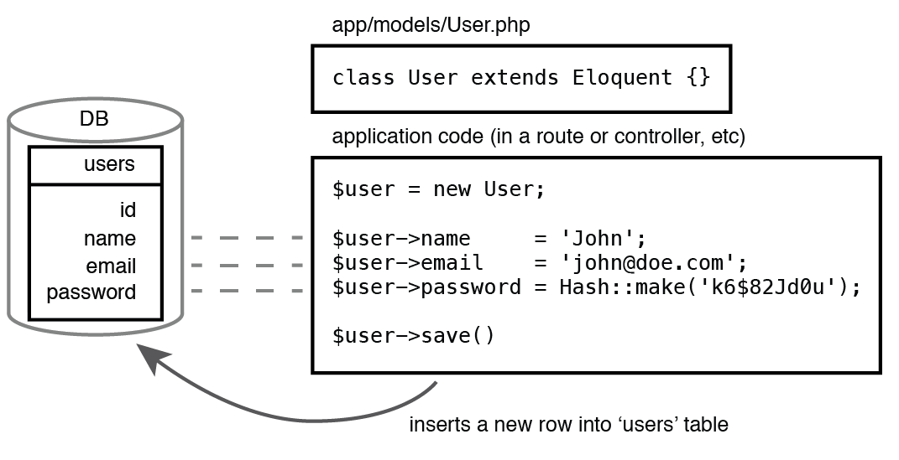
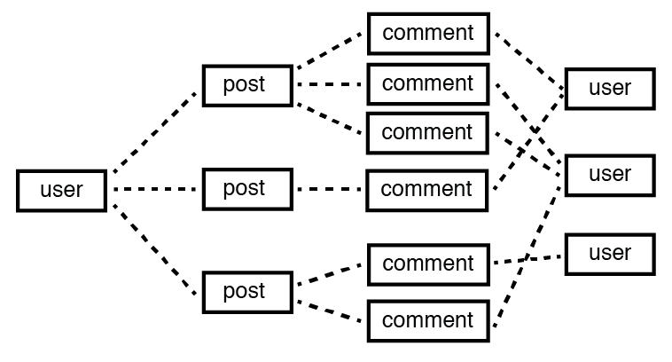
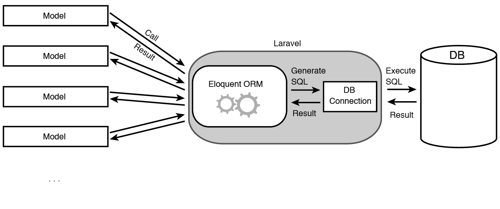
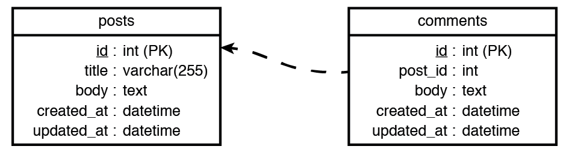
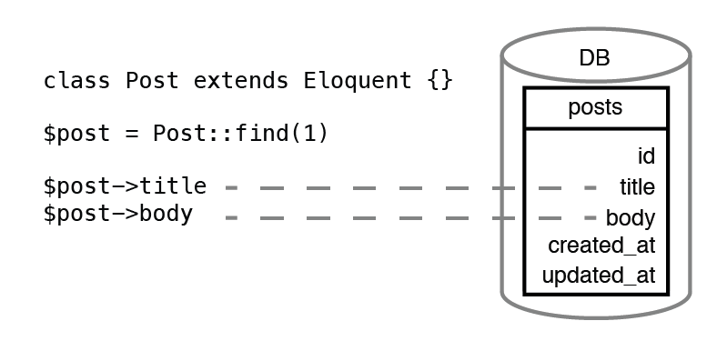

# Laravel Eloquent 用法

>本文翻译自 [《Laravel - My first framework》](https://leanpub.com/laravel-first-framework/)

# Eloquent 简介
Eloquent 是 Laravel 提供的 ORM 实现。它将数据库抽象为对象，这些对象 (也称为「模型」) 被创建、更新或删除时，Eloquent 会在数据库中进行相应的更改。

下图显示了一个 Eloquent 的简单示例，通过创建一个新的 PHP 对象并为其属性分配值，在表 `users` 中插入一行：



Eloquent 通过创建数据之间的关系，简化了复杂数据库结构的工作。它内置了各种关联关系：

* 将记录从一个表链接到另一个表的另一个记录（一对一关联）
* 将记录从一个表链接到不同表中的多个记录（一对多关联）
* 将一个表中的一些记录链接到另一个表中的记录数（多对多关联）
* 一个表的记录可以动态链接到许多其他表（多态关联）
* 更多

数据库中数据实体之间的这些内置关系帮助开发人员轻松的处理数据。 例如，下图显示了一个博客程序中用户、贴子、评论的数据实体之间关系：



Eloquent 使用「模型」的概念来表示数据库中的数据，接下来我们看一下它的概念。

## Model - 模型
像其他 ORM 实现一样，Eloquent 的「模型」是一个特殊的类，它表示数据库中的单个表。 使用「模型」可以以对象的方式来处理数据库中的数据。

当这些类 (模型) 使用 Eloquent 的功能时，Laravel 会自动进行数据库的 SQL 查询并返回结果：



>将「模型」视为应用程序使用的对象或实体。 例如，如果应用程序是一个在线商店，那么它所使用的对象就是产品，订单，产品类别，用户等。如果应用程序是 SNS - 对象将是状态，照片，视频， 位置，用户之间的关系等。以这种方式表示实体可以大大简化数据库的结构，并使您能够在应用程序中使用 Eloquent。

## 定义模型时的约定

通过 Eloquent 的模型处理数据库表时，Laravel 主要有三个主要假设：

* 表的主键是一个名为 `id` 的无符号自动递增整型。
* 该表具有 `datetime` 类型的 `created_at` 和 `updated_at` 字段以存储创建时间、更新时间的时间戳。
* 如果模型类为 `User.php` ，则表名应该称为 `users`，即以模型类的蛇形、复数形式名称来作为数据表的名称

例如：
<table>
    <tr>
        <td>模型名</td>
        <td>表名</td>
    </tr>
    <tr>
        <td>User</td>
        <td>users</td>
    </tr>
    <tr>
        <td>Post</td>
        <td>posts</td>
    </tr>
    <tr>
        <td>Comment</td>
        <td>comments</td>
    </tr>
    <tr>
        <td>Person</td>
        <td>people</td>
    </tr>
    <tr>
        <td>Index</td>
        <td>indices</td>
    </tr>
    <tr>
        <td>PostCategory</td>
        <td>post_categories</td>
    </tr>
</table>

>定义模型名的时候，最好不要使用 Laravel 中已经用到的一些类名，例如：App, Auth, Cache, Config, Controller, Cookie, Crypt, Lang, Route, Event, Log, Schema, File, Mail, Session, Form, Password, View, Hash, Queue, Input, Request 等。

# 创建并使用 Eloquent
每个模型类对应了数据库中的一个表，例如有一个博客程序中的贴子表：


我们这样定义它：
```php
// app/Post.php
namespace App;

use Illuminate\Database\Eloquent\Model;

class Post extends Model {}
```

接下来就可以通过它来进行数据库的增、删、改、查各种操作了。

## 使用模型
Eloquent 提供了许多方法来操作数据库。 基本的方法如下：
all() - 取回所有记录
find($id) - 取回一条记录
first() - 取回第一条记录
save() - 将当前模型实例作为新记录添加到数据库中
create($data) - 通过数据数组创建一条新记录
delete() - 删除当前记录
destroy($id) - 删除主键值为 $id 的记录

与 Query Builder 一样，Eloquent 的大部分方法可以进行链式操作。它们还可以与 Query Builder 交替使用。

假设我们有下面两个表：


Eloquent 模型的属性表示模型对应的表的列，模型的属性表示列的值。例如，如果您想从 `posts` 表中检索 ID 为 1 的标题和内容，您可以访问 Post 模型的 `title` 和 `body` 属性，如下面的图所示：



## Inserting records - 插入记录
```php
try
    Route::get('posts/new', function(){
    // Create a new instance of the Post model
    $post = new App\Post;
    // Assign values to model’s attributes
    $post->title = "My first post";
    // Assign values to model’s attributes
    $post->body = "This post is created with Eloquent";
    // Insert the record in the DB
    $post->save();
    // Display the new record containing the blog post
    return $post;
});
```

Laravel 背后的执行过程如下：



这时就可以发现 Eloquent 与 Query Builder 的区别了：

* 通过模型不需要指定记录将插入哪个表。 
* 通过使用对象而不是运行任何数据库操作来完成新记录的创建。

## Retrieving records - 检索记录
Query Builder 中有 `find($id)` 和 `get()` 两个方法，
Eloquent 另外提供了 `all()` 和 `first()` 两个方法。

### 使用 Query Builder 的 find() 取回单条记录
```php
// Retrieve a record with primary key (id) equal to “2”
$comment = Comment::find(2);

// If there is a comment with ID “2”, The $comment variable will contain: 
/*
object(Comment)#137 (20) {
["attributes":protected]=> array(5) {
        ["id"]=>
        string(1) "2"
        ["post_id"]=>
        string(1) "1"
        ["body"]=>
        string(17) "My second comment"
        ...
    }
    ...
}
*/
```

这个相当于：
```php
Comment::where('id',$id)->get();
```

### 使用 Eloquent 的 first() 取回单条记录
`first()` 用来检索第一条记录：
```php
 Route::get('comments/first', function() {
    $comment = Comment::where('body', 'like', '%comment%')->first(); 
});
```

### 使用 all() 取回所有记录
```php
Route::get('comments', function() {
    $comments = Comment::all();
});
```

>注意：使用 all() 时，不管它前面有没有其它限定性的操作，都将返回全部记录。

### 使用 get() 取回多条记录
`get()` 有以下功能：

* 检索模型对应表的所有记录
* 对查询结果进行过滤、分组、排序
* 检索特定记录

取回所有记录：
```php
Route::get('comments', function() {
    $comments = Comment::get();
});
```

过滤数据：
```php
Route::get('published', function() {
    $posts = Post::where('title', 'like', '%Laravel%')->get();
});
```

指定检索的列：
```php
Route::get('posts', function() {
    $posts = Post::get(['title','body']);
});

/*
object(Illuminate\Database\Eloquent\Collection)#149 (1) {
    ["items":protected]=> array(1) {
        [0]=>
            object(Post)#137 (20) {
            ... ["attributes":protected]=> array(2) {
                    ["title"]=>
                    string(13) "My first post"
                    ["body"]=>
                    string(34) "This post is created with Eloquent"
            }
        ...
    } 
}

*/
```

## Updating records - 更新记录
可以使用如下步骤来更新记录：

1. 通过在模型上使用 `find()`, `get()` 或 `first()` 来检索属于模型的记录
2. 为模型的属性分配新值
3. 在模型上调用 `save()` 来保存数据库中的更改

```php
Route::get('posts/update', function() {
    $post = Post::find(1);

    $post->title = "Updated title"; 

    $post->save();
});
```

>注意：Eloquent 不允许一次性更新多条记录，如有需要可以使用 Query Builder 的 update() 方法。

## Deleting records - 删除记录
可以使用 `delete()` 删除当前模型实例的记录：
```php
Route::get('posts/delete', function() {
    $post = Post::find(1);

    $post->delete();
});
```

也可以使用 `destory($id)` 删除指定 `$id` 的记录：
```php
Route::get('posts/destory', function() {
    $post = Post::destory(1);
});
```

有关 Eloquent 的更多知识请参考官方文档：

*   [Eloquent 入门](https://laravel.com/docs/5.5/eloquent)
*   [模型关联](https://laravel.com/docs/5.5/eloquent-relationships)
