# Laravel Query Builder 原理及用法

>本文翻译自 [《Laravel - My first framework》](https://leanpub.com/laravel-first-framework/)

从 `CURD` 到 `排序` 和 `过滤`，`Query Builder` 提供了方便的操作符来处理数据库中的数据。这些操作符大多数可以组合在一起，以充分利用单个查询。

`Laravel` 一般使用 `DB` facade 来进行数据库查询。当我们执行 `DB` 的「命令」(、或者说「操作符」)时，`Query Builder` 会构建一个 SQL 查询，该查询将根据 `table()` 方法中指定的表执行查询。

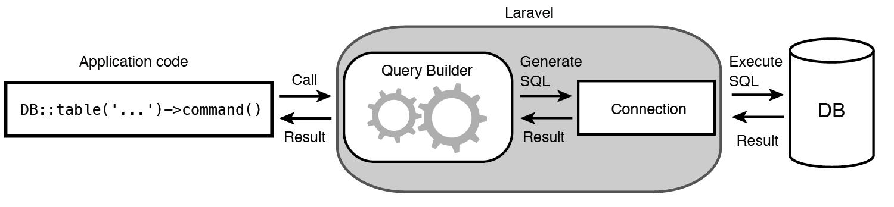

该查询将使用 `app/config/database.php` 文件中指定的数据库连接执行。 查询执行的结果将返回：检索到的记录、布尔值或一个空结果集。

下表中是 `Query Builder` 的常用操作符：

<table>
    <tr>
        <td>操作符</td>
        <td>描述</td>
    </tr>
    <tr>
        <td>insert(array(...))</td>
        <td>接收包含字段名和值的数组，插入数据至数据库</td>
    </tr>
    <tr>
        <td>find($id)</td>
        <td>检索一个主键 id 等于给定参数的记录</td>
    </tr>
    <tr>
        <td>update(array(...))</td>
        <td>接收含有字段名和值的数组，更新已存在的记录</td>
    </tr>
    <tr>
        <td>delete()</td>
        <td>删除一条记录</td>
    </tr>
    <tr>
        <td>get()</td>
        <td>返回一个 Illuminate\Support\Collection 结果，其中每个结果都是一个 PHP StdClass 对象的实例，实例中包含每行记录中的列名及其值</td>
    </tr>
    <tr>
        <td>take($number)</td>
        <td>限制查询结果数量</td>
    </tr>
</table>

接下来，将讲解 `Query Builder` 的各种操作。

# CURD
## Inserting records - 插入
`insert` 操作符将新行（记录）插入到现有表中。我们可以通过提供数据数组作为 `insert` 运算符的参数来指定要插入到表中的数据。

假设有一个 `orders` 表：
<table>
    <tr>
        <td>Key</td>
        <td>Column</td>
        <td>Type</td>
    </tr>
    <tr>
        <td>primary</td>
        <td>id</td>
        <td>int (11), auto-incrementing</td>
    </tr>
    <tr>
        <td></td>
        <td>price</td>
        <td>int (11)</td>
    </tr>
    <tr>
        <td></td>
        <td>product</td>
        <td>varchar(255)</td>
    </tr>
</table>

### 插入单行数据
把数据数组传给 `insert` 操作符，来告诉 `Query Builder` 插入新行：
```php
DB::table('orders')->insert(
    [
        'price' => 200, // 设置 price 字段值
        'product' => 'Console', // 设置 product 字段值
    ]
);
```

`Query Builder`将 `insert` 命令转换为特定于 `database.php` 配置文件中指定的数据库的 SQL 查询。 作为参数传递给 `insert` 命令的数据将以参数的形式放入 SQL 查询中。 然后，SQL 查询将在指定的表 "orders" 上执行，执行结果将返回给调用者。  
下图说明了整个过程：

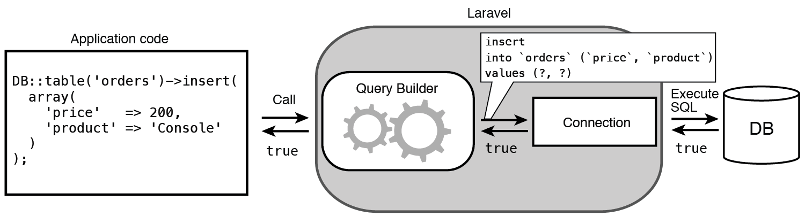

>可以看到，Laravel 使用 PDO 来执行 SQL 语句。通过为数据添加占位符来使用准备好的语句可以增强 SQL 注入的保护性，并增加数据插入和更新的安全性。

### 插入多行数据
`Query Builder` 的 `insert` 操作符同样可用于插入多行数据。 传递一个包含数组的数组可以插入任意数量的行：

```php
DB::table('orders')->insert(
    [
        ['price' => 400, 'product' => 'Laptop'],
        ['price' => 200, 'product' => 'Smartphone'],
        ['price' => 50, 'product' => 'Accessory'],
    ]
);
```

此 `insert` 语句将创建三个新记录，Laravel 构建的 SQL 查询是：
```
insertinto`orders`(`price`,`product`)values(?,?),(?,?),(?,?)
```

>可以看到， Laravel 聪明地在一个查询中插入三行数据，而不是运行三个单独的查询。 

## Retrieving records - 检索

`Query Builder` 提供了多种从数据库获取数据的操作符，以灵活的适应许多不同的情况，例如：

*   检索单个记录
*   检索表中的所有记录
*   仅检索表中所有记录的特定列
*   检索表中有限数量的记录

### 检索单个记录

可以使用 `find` 操作符从表中检索单个记录。只需提供要检索的记录的主键的值作为 `find` 的参数，Laravel 将返回该记录作为对象。如果未找到该记录，则返回 `NULL`。

```php
$order = DB::table('orders')->find(3); 

/*
object(stdClass)#157 (3) {
    ["id"]=>string(1) "3"
    ["price"]=>string(3) "200"
    ["product"]=>string(10) "Smartphone"
 }
 */
```

> 注意： `find` 操作符以 `id` 作为主键进行查询，如想使用别的主键，请使用其它操作符。

Laravel 构建的 SQL 查询是：
```
select * from `orders` where `id` = ? limit 1
```

### 检索表中的所有记录
要从表中检索所有记录，可以使用 `get` 操作符而不用任何参数。在指定的表上运行 `get` (前面没有别的操作符) 将会将该表中的所有记录作为对象数组返回。

```php
$orders = DB::table('orders')->get();

/*
array(4) { [0]=>
    object(stdClass)#157 (3) { 
        ["id"]=>string(1) "1"
        ["price"]=>string(3) "200"
        ["product"]=>string(7) "Console"
    }
    
    ... 3 more rows returned as objects ...
}
*/
```

Laravel 构建的 SQL 查询是：
```
select * from `orders`
```

### 检索仅包含特定列的所有记录
将所需的列名作为参数数组传递给 `get` 运算符，可获得表中所有记录的特定列。

```php
$orders = DB::table('orders')->get(['id','price']);

/*
array(4) { [0]=>
    object(stdClass)#157 (2) {
        ["id"]=>string(1) "1"
        ["price"]=>string(3) "200"
    }
    ... 3 more rows returned as objects ... 
}
*/
```

Laravel 构建的 SQL 查询是：
```
select `id`, `price` from `orders`
```

### 检索表中有限数量的记录
要指定要从表中获取的最大记录数，可以使用 `take` 操作符，并将 `get` 附加到查询中。

```php
$orders = DB::table('orders')->take(50)->get();
```

$orders 数组中最多有 50 条数据。

## Updating records - 更新

使用 `Query Builder` 更新记录与创建新记录非常相似。要更新现有记录或一组记录的数据，可以将操作符 `update` 附加到查询中，并将一个新数据数组作为参数传递给它。同时可以使用查询链定位要更新的特定记录。

### 更新特定记录

使用 `where` 操作符来指定特定记录并更新：
```php
DB::table('orders')
    ->where('price','>','50')
    ->update(['price' => 100]);
```

Laravel 构建的 SQL 查询是：
```
update `orders` set `price` = ? where `price` > ?
```

### 更新所有记录
如果不限定条件直接使用 `update` ，将更新表中所有记录：

```php
DB::table('orders')->update(['product'=>'Headphones']);
```

Laravel 构建的 SQL 查询是：
```
update `orders` set `product` = ?
```

## Deleting records - 删除
使用 `Query Builder` 从表中删除记录遵循与更新记录相同的模式。 可以使用 `delete` 操作符删除与某些条件匹配的特定记录或删除所有记录。

### 删除特定记录
使用 `where` 操作符来指定要删除的特定记录：

```php
DB::table('orders')
    ->where('product','=','Smartphone')
    ->delete();
```

Laravel 构建的 SQL 查询是：
```
delete from `orders` where `product` = ?
```

# Filtering, sorting and grouping data - 过滤，排序和分组
在数据库应用程序中管理数据时，往往需要对哪些记录进行严格的控制。 这可能是要准确地获得应用程序规范要求的数据集，或者只删除符合某些条件的几条记录。 如果使用纯 SQL ，其中一些操作可能会变得非常复杂。 Laravel 的 `Query Builder` 允许过滤，排序和分组数据，同时保持清晰一致的语法，易于理解。

下表中是 `Query Builder` 的常用的过滤、排序和分组操作符：
<table>
    <tr>
        <td>操作符</td>
        <td>描述</td>
    </tr>
    <tr>
        <td>where('column','comparator','value')</td>
        <td>检索符合条件的记录</td>
    </tr>
    <tr>
        <td>orderBy('column','order')</td>
        <td>按指定的列和顺序排序记录（升序或降序）</td>
    </tr>
    <tr>
        <td>groupBy('column')</td>
        <td>按列分组</td>
    </tr>
</table>

## Query Chaining - 查询链
查询链接允许在单个查询中运行多个数据库操作。查询链将可以与数据执行的各种动作的顺序相互结合，以获得可以操作的特定结果。通过各种参数过滤、排序数据等等可以表示为对表中的数据执行的一系列操作：

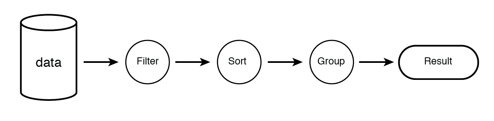

Laravel 允许根据需要将多个查询放在一起。查询链接可以显着减少编写的代码量来执行复杂的数据库操作。 例如，要对 `users` 表执行上述操作，可以将过滤和排序一起放入单个查询链，如图所示：

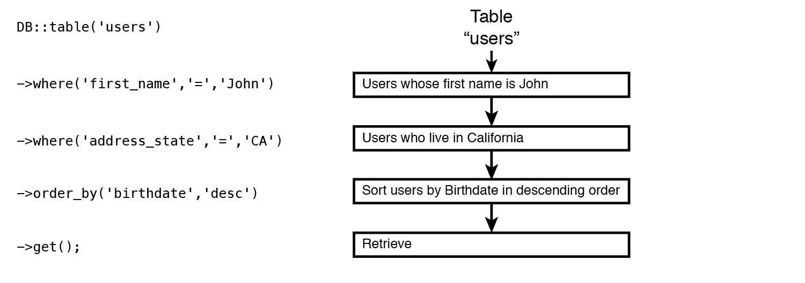

> 注意：可以使用查询链来执行多个操作，如排序、过滤、分组，以精确定位可以进一步检索、更新或删除的一组数据。 但不能在单个查询中将 insert/get/update/delete 操作混合在一起。

## Where 操作符
`Query Builder` 的 `Where` 操作符提供了一个干净的接口，用于执行 SQL 的 WHERE 子句，并具有与之非常相似的语法。例如：

*   选择符合特定标准的记录
*   选择符合任一条件的记录
*   选择具有特定值范围的列的记录
*   选择列超出值范围的记录

使用 `where` 选择记录后，可以执行之前讨论过的任何操作：检索、更新或删除。

### 简单的 where 查询
`where` 的查询由提供用于过滤数据的三个参数组成：

*   用于比较的列名
*   用于比较的运算符
*   用于比较的值

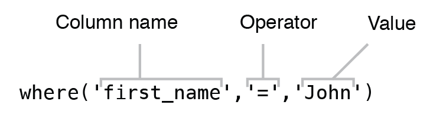

> 如果仅将两个参数传递给 `where` 操作符， Laravel 会默认使用 `=` 进行比较，可以减少代码量。

下表是常用的 `where` 比较运算符：

<table>
    <tr>
        <td>运算符</td>
        <td>描述</td>
    </tr>
    <tr>
        <td>=</td>
        <td>等于</td>
    </tr>
    <tr>
        <td><</td>
        <td>小于</td>
    </tr>
    <tr>
        <td>></td>
        <td>大于</td>
    </tr>
    <tr>
        <td><=</td>
        <td>小于等于</td>
    </tr>
    <tr>
        <td>>=</td>
        <td>大于等于</td>
    </tr>
    <tr>
        <td><\> 或!=</td>
        <td>不等于</td>
    </tr>
    <tr>
        <td>like</td>
        <td>模糊查询</td>
    </tr>
    <tr>
        <td>not like</td>
        <td>模糊查询</td>
    </tr>
</table>

除了使用单个 `where` 操作符，还可可以链接多个 `where` 来进一步过滤结果。 Laravel 会在 SQL 语句中自动将 `AND` 链接在 `where` 操作符之间。 

```php
$users = DB::table('users')
            // Match users whose last_name column starts with “A” 
            ->where('last_name', 'like','A%')
            // Match users whose age is less than 50 
            ->where('age','<' ,50)
            // Retrieve the records as an array of objects 
            ->get();
```

Laravel 构建的 SQL 查询是：
```
select * from `users` where `last_name` like ? and `age` < ?
```

### orWhere

通过使用 `orWhere` 操作符可以选择几个匹配至少一个条件的数据。它具有与 `where` 操作符完全相同的语法，并且必须将其附加到现有的 `where`操作符，以使其运行。

```php
$orders = DB::table('orders')
            // Match orders that have been marked as processed 
            ->where('processed', 1)
            // Match orders that have price lower than or equal to 250 
            ->orWhere('price','<=' ,250)
            // Delete records that match either criterion
            ->delete();
```

Laravel 构建的 SQL 查询是：
```
delete from `orders` where `processed` = ? or `price` <= ?
```

### whereBetween
`whereBetween` 方法用来验证字段的值介于两个值之间。它只需要两个参数，一个用于匹配的列和一个包含两个数值的数组，表示一个范围。

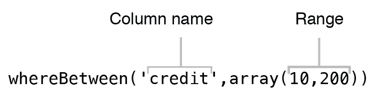

```php
$users = DB::table('users')
            // Match users that have the value of “credit” column between 100 and 300 
            ->whereBetween('credit', [100,300])
            // Retrieve records as an array of objects
            ->get();
```

Laravel 构建的 SQL 查询是：
```
select * from `users` where `credit` between ? and ?
```

## orderBy - 排序
`Query Builder` 的 `orderBy` 操作符提供了一种简单的方法来对从数据库检索的数据进行排序。 `orderBy` 类似于 SQL 中的 ORDER BY 子句。要通过一些列对一组数据进行排序，需要将两个参数传递给 `orderBy` ：排序数据的列和排序方向（升序或降序）。

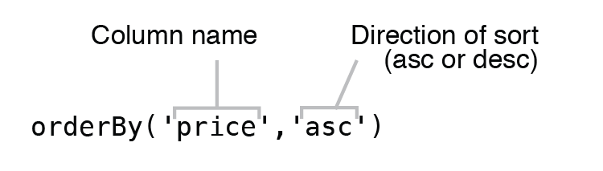

将 `orderBy` 操作符应用于由 `Query Builder` 的一个操作符检索的一组数据，将根据列名称和指定的方向对数据进行排序。

```php
$products = DB::table('products')
                // Sort the products by their price in ascending order 
                ->orderBy('price', 'asc')
                // Retrieve records as an array of objects
                ->get();
```

还可以使用查询链来适应更复杂的过滤和排序方案。
```php
$products = DB::table('products')
                // Get products whose name contains letters “so” 
                ->where('name','like','%so%')
                // Get products whose price is greater than 100 
                ->where('price','>', 100)
                // Sort products by their price in ascending order 
                ->orderBy('price', 'asc')
                // Retrieve products from the table as an array of objects 
                ->get();
```

像 `where` 一样，`orderBy` 操作符是可链接的，可以组合多个 `orderBy` 以获取需要实现的排序结果。

## groupBy - 分组
可以使用类似于 SQL 中 GROUP BY 子句的 `groupBy` 操作符将记录组合在一起。 它只接受一个参数：用于对记录进行分组的列。

```php
$products = DB::table('products')
            // Group products by the “name” column
            ->groupBy('name')
            // Retrieve products from the table as an array of objects 
            ->get();
```

## JOIN - 联结
Laravel 的 `Query Builder` 支持数据库所有类型的 Join 语句。 联结语句用于组合具有这些表共同值的多个表中的记录。 例如有两个表 `users` 和 `orders` ，其内容如图所示：

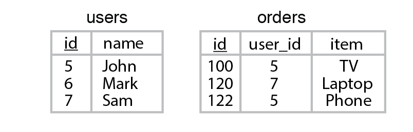

虽然可以使用 Join 语句组合两个以上的表，但是我们将仅使用图中的两个表来演示可以在 `Query Builder` 中使用的 Join 语句类型。

> 注意：如果联结的表具有相同名称的列，则应小心。 可以使用 `select()` 来代替重复的列。


### Inner Join - 内联结
`Inner Join` 是一种简单而常见的 Join 类型。 它用于返回一个表中在另一个表中具有完全匹配条件的所有记录。 

> 可以使用查询链组合多个 `join` 操作符，来联结两个以上的表。

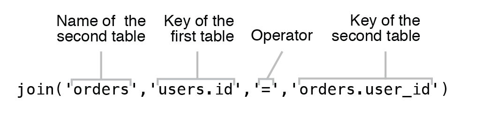

```php
// Use table “users” as first table
$usersOrders = DB::table('users')
    // Perform a Join with the “orders” table, checking for the presence of matching
    // “user_id” column in “orders” table and “id” column of the “user” table. 
    ->join('orders', 'users.id', '=', 'orders.user_id')
    // Retrieve users from the table as an array of objects containing users and
    // products that each user has purchased
    ->get();
```

Laravel 构建的 SQL 查询是：
```
select * from `users` inner join `orders` on `users`.`id` = `orders`.`user_id`
```

下图显示了内联结为两组数据之间的阴影区域的结果。

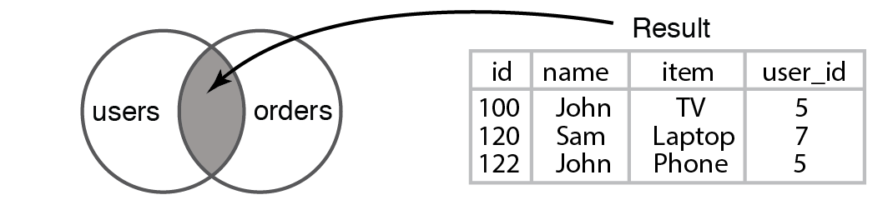

### Left Join - 左联结
左连接比内连接更具包容性，并具有类似的语法。 它生成一组在两个表之间匹配的记录，另外它返回从第一个表中有而其它表中没有匹配的所有记录。 语法的唯一区别是使用 `leftJoin` 操作符而不是 `join`。

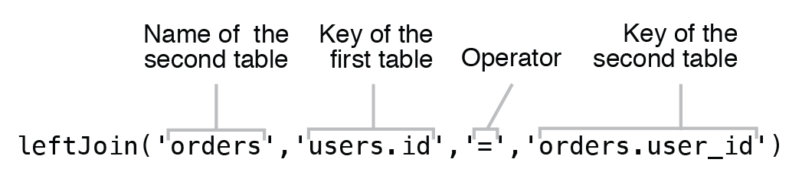

```php
// Use table “users” as first table
$usersOrders = DB::table('users')
    // Perform a Left Join with the “orders” table, checking for the presence of
    // matching “user_id” column in “orders” table and “id” column of the “user” table. 
    ->leftJoin('orders', 'users.id', '=', 'orders.user_id')
    // Retrieve an array of objects containing records of “users” table that have
    // a corresponding record in the “orders” table and also all records in “users”
    // table that don’t have a match in the “orders” table
    ->get();
```

Laravel 构建的 SQL 查询是：
```
select * from `users` left join `orders` on `users`.`id` = `orders`.`user_id`
```

此查询将包含 `users` 中的所有行，而不管 `orders` 表中是否具有匹配的条目。结果列的值将与具有内联结的值相同，但是来自 `users` 表中的那些不在 `orders` 中匹配的行将返回 `id`，`item` 和 `user_id`列。

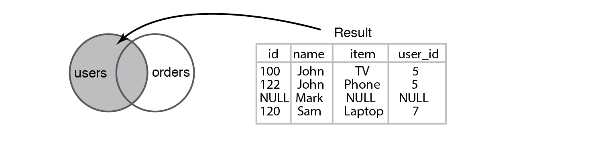

### 其它类型的联结
Laravel 的 `Query Builder` 非常灵活，可以考虑连接查询的特殊情况，并允许执行数据库支持的所有类型的连接查询。 大多数SQL数据库引擎 (如 MySQL 和 SQLite) 支持 内左、右联结/外左、右联结，其他 SQL 引擎 (如 Postgres 和SQL Server) 还支持完全联结。  
可以通过向 `join` 操作符提供第五个参数，指定要执行的 Join 查询类型，来执行数据库支持的任何类型的联结。

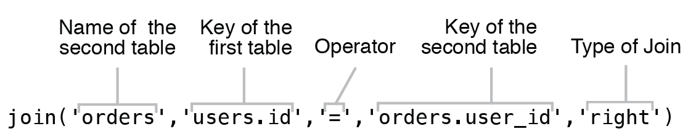

下面显示了与 Laravel 支持的所有数据库引擎的 Join 类型：
```php
// Right Join
join('orders', 'users.id', '=', 'orders.user_id','right') // Right Outer Join
join('orders', 'users.id', '=', 'orders.user_id','right outer')
// Excluding Right Outer Join
join('orders', 'users.id', '=', 'orders.user_id','right outer') ->where('orders.user_id',NULL)
// Left Join
join('orders', 'users.id', '=', 'orders.user_id','left') // Left Outer Join
join('orders', 'users.id', '=', 'orders.user_id','left outer')
// Excluding Left Outer Join
join('orders', 'users.id', '=', 'orders.user_id','left outer') ->where('orders.user_id',NULL)
// Cross join
join('orders', 'users.id', '=', 'orders.user_id','cross')
```

以上就是 `Laravel Query Builder` 的介绍，下一篇文章中将讲解 `Laravel Eloquent` 的用法。